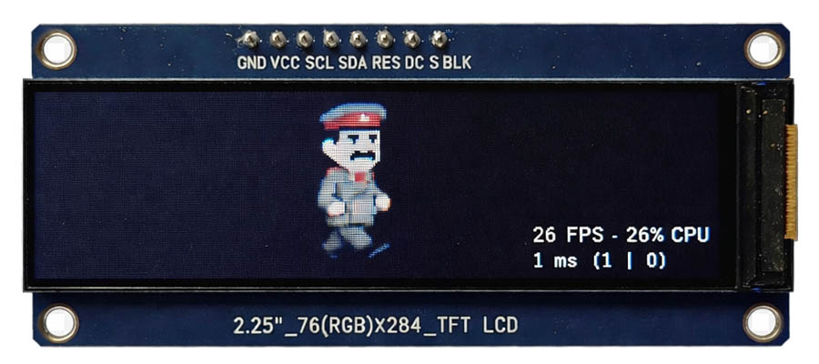

# ESP32 LVGL Template: ST7789 2.25" (284x76px) TFT LCD

This is a ready-to-use template for the non-standard 2.25-inch ultra-wide TFT display driven by the ST7789 controller. It integrates **LVGL 9** with **FreeRTOS** on the **ESP-IDF** framework.



## Hardware Specifications
* **Display:** 2.25" TFT LCD
* **Resolution:** 284 x 76 px
* **Controller:** ST7789 (SPI)
* **Platform:** ESP32 (Support for S3, C3, and others)

## Features
* **FreeRTOS Integration:** LVGL ticks are synchronized with the FreeRTOS heartbeat.
* **DMA Optimized:** Smooth rendering using SPI DMA transfers.
* **Sprite Animation:** Example of a synchronized sprite sheet animation (walking animation).
* **Clean Structure:** Fully documented code with English comments.

## Pinout (Default)
| ESP32 Pin | Display Pin | Function |
|-----------|-------------|----------|
| GPIO 12   | SCLK        | SPI Clock|
| GPIO 11   | MOSI        | SPI Data |
| GPIO 8    | CS          | Chip Sel |
| GPIO 9    | DC          | Data/Cmd |
| GPIO 10   | RST         | Reset    |
| GPIO 13   | BLK         | Backlight|

## Changing the Platform (S3, C3, etc.)
To switch to a different ESP32 chip, follow these steps:

1.  **Re-set the target:**
    ```bash
    idf.py set-target esp32s3  # or esp32c3, esp32s2
    ```
2.  **Update Pins:**
    Open `main/main.c` and update the `PIN_` definitions to match your specific hardware wiring.
3.  **Check SPI Host:**
    Standard ESP32 uses `SPI2_HOST`. For some chips, you might need to ensure the host matches the available peripherals.

## Compilation and Flashing

1.  **Clone the repo:**
    ```bash
    git clone [https://github.com/webbug-dev/tpl_st7789_2_25_esp32.git](https://github.com/webbug-dev/tpl_st7789_2_25_esp32.git)
    cd tpl_st7789_2_25_esp32
    ```
2.  **Configure (optional):**
    ```bash
    idf.py menuconfig
    ```
    *Note: LVGL 9 and FreeRTOS settings are already optimized in the sdkconfig.*

3.  **Build and Flash:**
    ```bash
    idf.py build flash monitor
    ```

## Customizing the Sprite
The animation uses an image atlas (sprite sheet). If you want to change the animation:
1.  Prepare a PNG with your frames arranged horizontally.
2.  Use a converter or the provided Python script to generate a C-array.
3.  Update `FRAME_W` and `FRAME_CNT` in `main.c`.

## License
MIT
